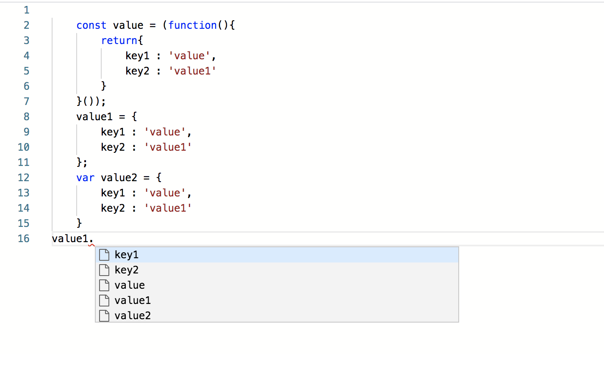
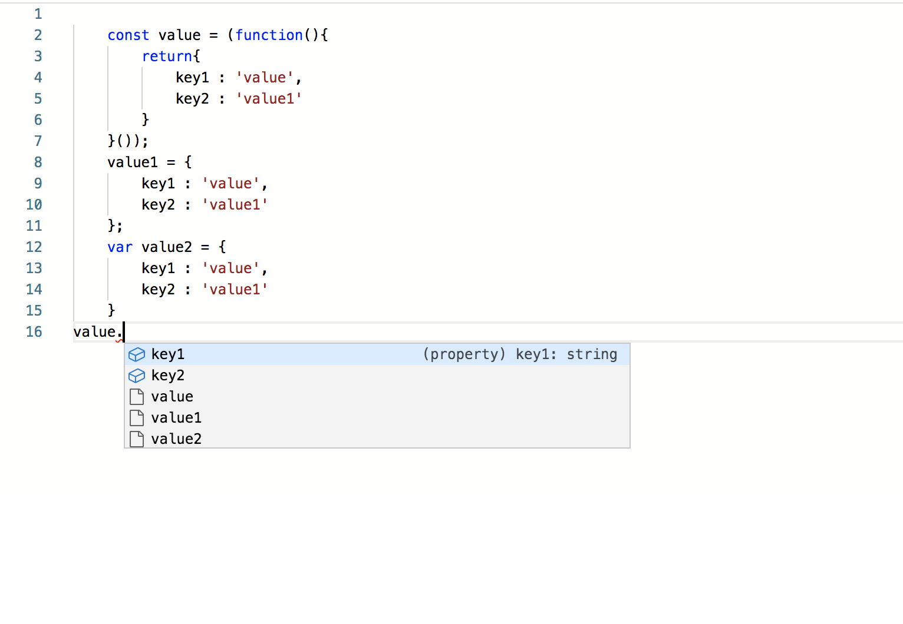
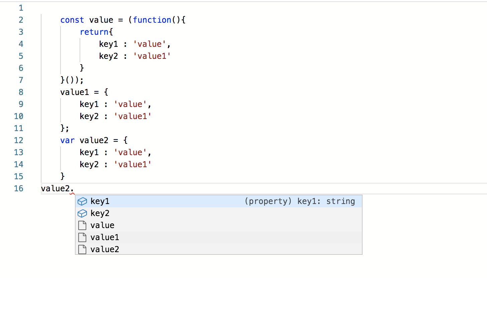

# Issue in Editors Suggestion

To reproduce this issue,

- Clone this [repository](https://github.com/Pranomvignesh/monacoEditorSuggestionIssue.git)
- Run `npm install`
- Run `npm start`
- Go to any browser and enter the url `http://localhost:8080/`
  
### Examples :  
#### Suggestion from global object variable

`This suggestions for the global object is not properly rendered as properties`

#### Suggestion from anonymous function return

#### Suggestion from declared object variable

